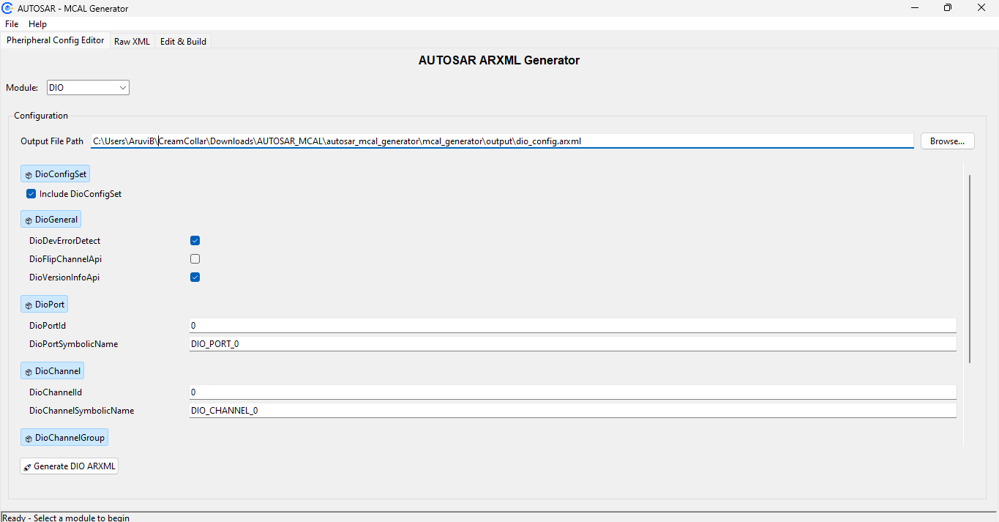
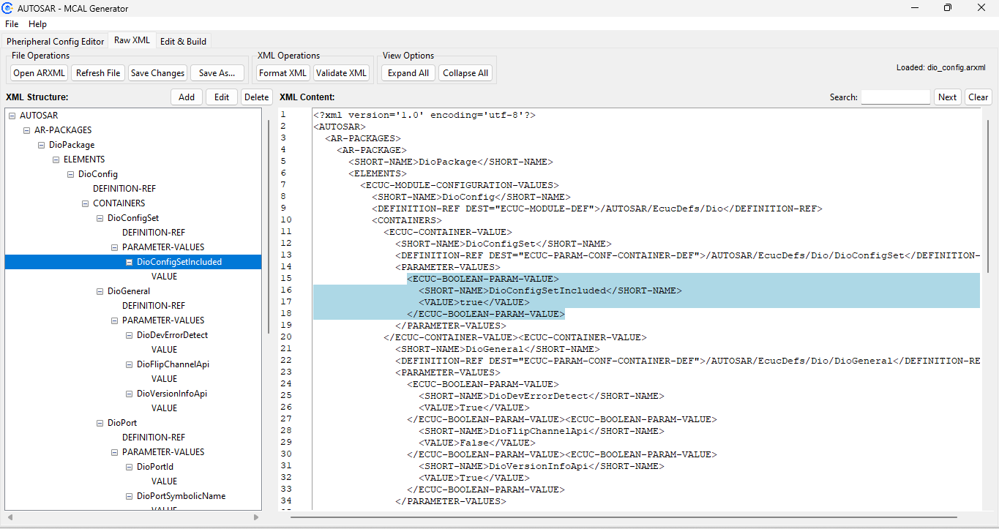
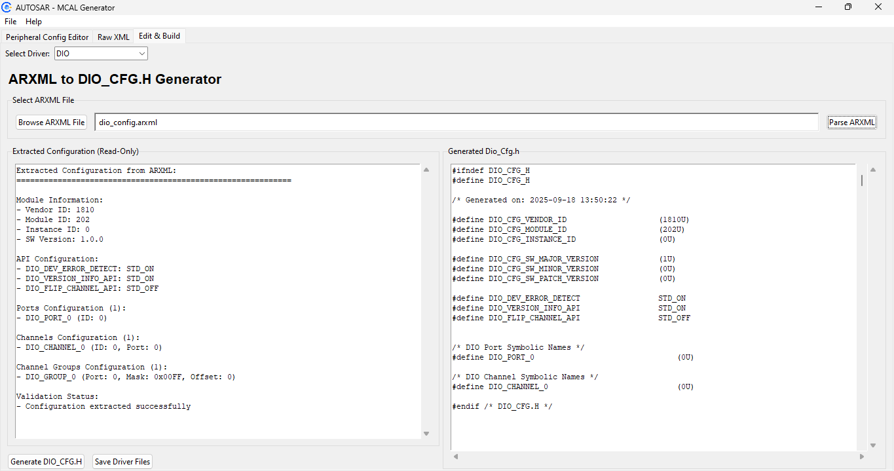

# AUTOSAR - MCAL Generator


A desktop application for generating AUTOSAR MCAL (Microcontroller Abstraction Layer) configurations and code from ARXML files. This tool simplifies the process of configuring and generating drivers for the DIO, ADC, CAN module.

## Autosar Architecture


## Application Overview


## Features Involved

| Peripheral Config Editor | Raw XML View | Edit and Build |
| :---: | :---: | :---: |
|  |  |  |

## Features

*   **ARXML Parsing:** Import and parse AUTOSAR XML (.arxml) files.
*   **Configuration Viewing:** View the parsed ARXML data in a structured format.
*   **Code Generation:** Generate C code for the DIO module based on the ARXML configuration.
*   **User-Friendly GUI:** An intuitive graphical user interface built with tkinter.

## Technologies Used

*   **Language:** Python
*   **GUI Framework:** Tkinter
*   **Template Engine:** Parse library
*   **Data Format:** ARXML (AUTOSAR XML)

## Running with Docker (Recommended)

The easiest way to run the MCAL Generator is by using the pre-built Docker image from Docker Hub.

### On Linux

1.  **Pull the Docker image:**
    ```bash
    docker pull aruviot/mcal-app:v1
    ```
2.  **Run the container:**
    ```bash
    docker run -it --rm -e DISPLAY=$DISPLAY -v /tmp/.X11-unix:/tmp/.X11-unix aruviot/mcal-app:v1
    ```

### On Windows

Running a GUI application from a Docker container on Windows requires an X Server.

1.  **Install an X Server:** Download and install [VcXsrv](https://sourceforge.net/projects/vcxsrv/).
2.  **Launch VcXsrv:** Start VcXsrv from the Start Menu. In the configuration wizard:
    *   Choose "Multiple windows".
    *   Set the display number to `0`.
    *   Choose "Start no client".
    *   Check "Disable access control".
    *   Finish the configuration.
3.  **Allow Firewall Access:** When prompted by your firewall, allow VcXsrv to communicate on public and private networks.
4.  **Pull the Docker image:**
    ```bash
    docker pull aruviot/mcal-app:v1
    ```
5.  **Run the container:** Open PowerShell and run the following command:
    ```powershell
    setx DISPLAY 127.0.0.1:0.0
    docker run --rm -e DISPLAY=host.docker.internal:0 aruviot/mcal-app:v1
    ```
    *Note: If you are not using WSL2, you might need to use `host.docker.internal` instead of the PowerShell command to get the IP address:* 
    
## Building from Source (For Integrators)

If you want to modify the code or build the application from source, follow these instructions.

### Prerequisites

*   Python 3.x
*   pip (Python package installer)
*   Git

### Installation

1.  **Clone the repository:**
    ```bash
    git clone https://github.com/aruvi-iot/MCAL-app.git
    ```
2.  **Navigate to the project directory:**
    ```bash
    cd MCAL-app
    ```
3.  **Create an env**
    ```bash
    python -m venv venv
    # On Unix/Linux/macOS:
    source venv/bin/activate
    
    # On Windows Command Prompt:
    venv\Scripts\activate
    ```

5.  **Install the required dependencies:**
    ```bash
    pip install -r requirements.txt
    ```

### Running the Application from Source

```bash
python main.py
```

### Building the Docker Image from Source

1.  **Build the image:**
    ```bash
    docker build -t aruviot/mcal-app .
    ```
2.  **Run the locally built image:** (See the "Running with Docker" section for the `docker run` command for your OS).

## License
This project is licensed under the GNU General Public License v3.0 (GPL-3.0).

You are free to use, study, modify, and redistribute this software,
provided that any redistributed or modified versions are released
under the same license.

See the [LICENSE](LICENSE) file for full details.

## Mentorship & Guidance:
- [Jegan Amirthalingam](https://www.linkedin.com/in/jegan-amirthalingam-44734738/) - for technical guidance and review

## Developer

*   **Aruvi B** - *Junior SDV Consultant* - [LinkedIn](https://linkedin.com/in/aruvib)
*   **Auroshaa A** - *Junior SDV Consultant – Cybersecurity* - [LinkedIn](https://www.linkedin.com/in/auroshaa-a-11587a294/)

This project is brought to you by [CreamCollar](https://www.creamcollar.com/).


